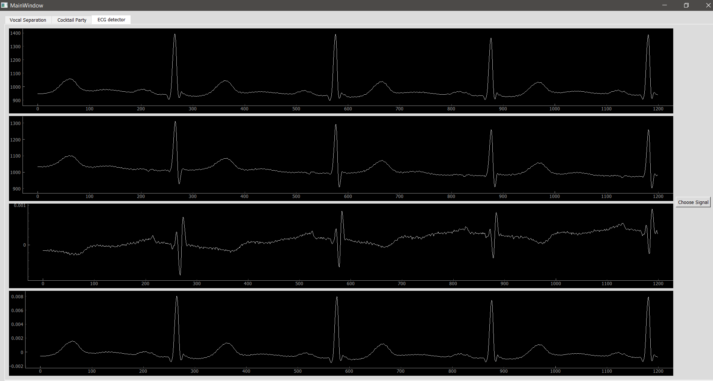
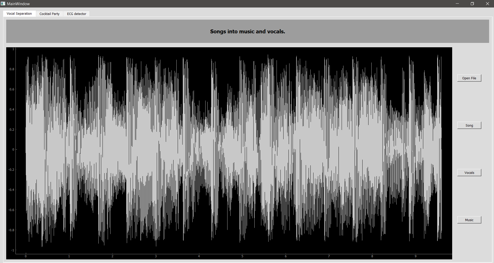
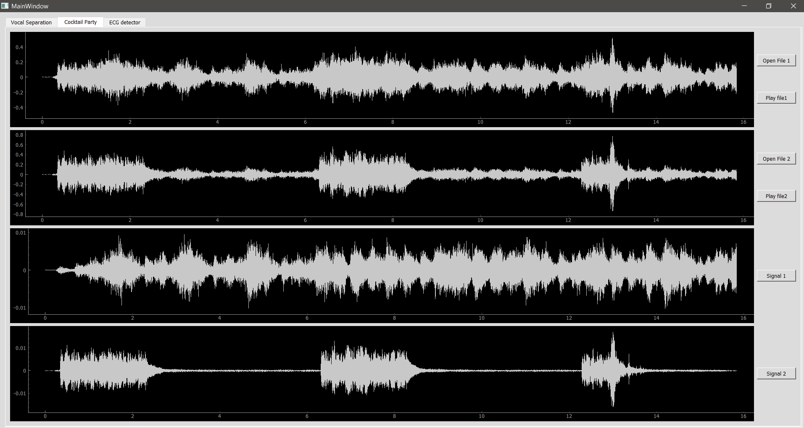

# Blind-Source-Separation

It is an app that aims to extract original unknown source signals from some mixed ones. This is done by calculating an approximate mixing function using only the available observed mixed signals.

THe term “Blind” means that the mixing function of signals which are recorded by microphones is unknown, that's why we use : Independent Component Analysis (ICA) is among the famous tools used for this job.

Our app allows the user to separate the following signals into their components:

A. Songs into music and vocals.

B. Two signals of your own choice.

He can choose from cocktail party voices mixture, abnormal ECG signal (i.e.
with arrhythmia), Event-related fMRI, or any other desired signal.

